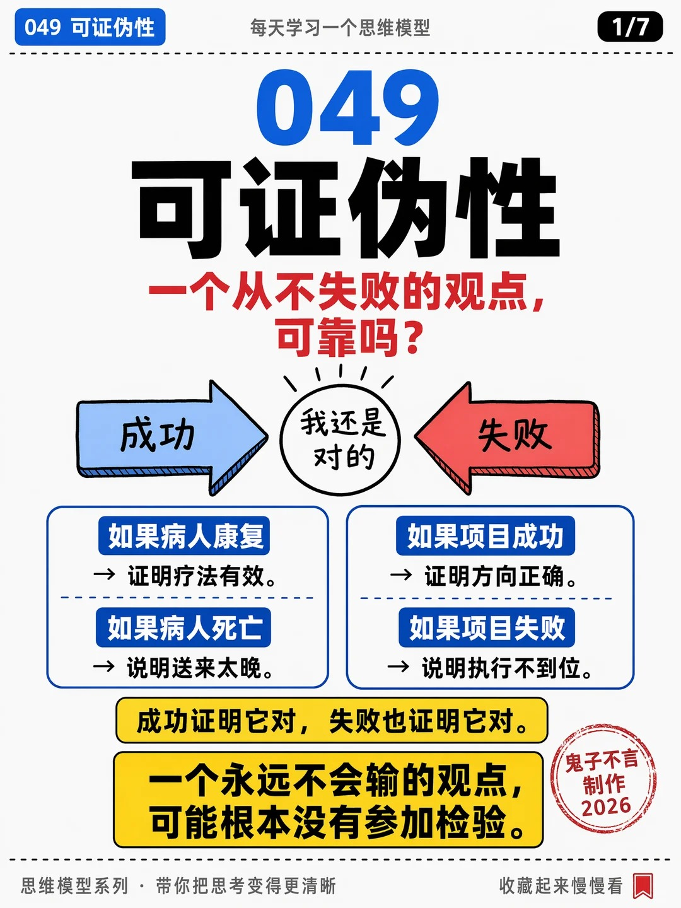
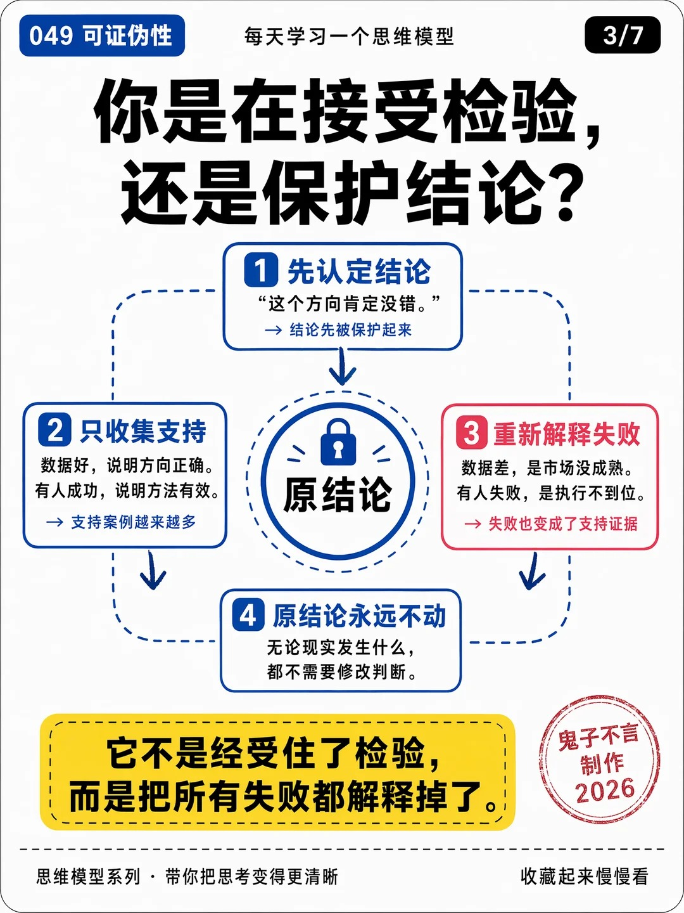
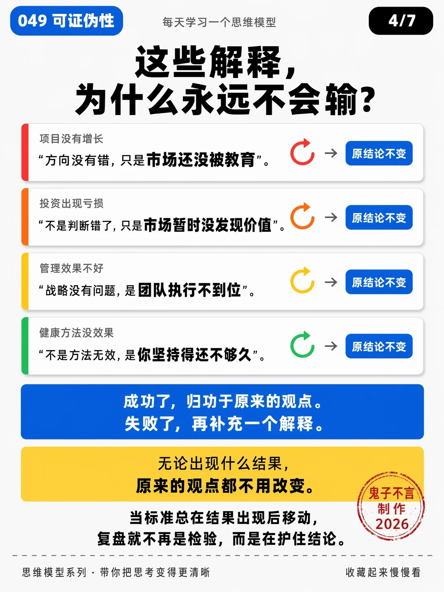
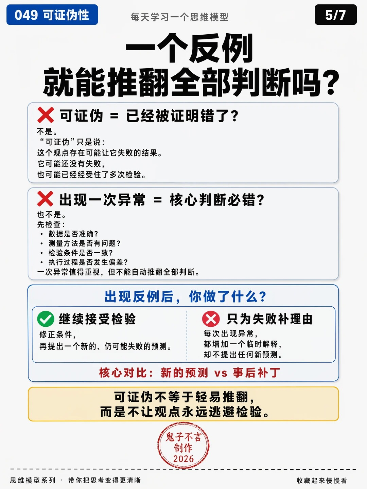

# 思维模型小红书制作

把已经定稿的思维模型文章，制作成一套可以检查、修改和交付的小红书图文素材：**发布正文、系列标题、七页分享图，以及审核和生成记录。**

这是「鬼子不言」思维模型系列使用的 Codex Skill，支持单篇和多篇批量制作。七张「049 可证伪性」原图随仓库提供，分别作为 P1—P7 的构图母版。

**默认使用顺序：先提供终稿文件，再明确说“开始小红书制作”。** 仅上传文件、声明“已经定稿”或输入模型编号，都不会自动开始。启动后，文案、审核、修改、制图、验收和打包连续执行，无须逐页确认。

[下载完整 Skill ZIP](https://github.com/sushengs-creator/thinking-model-xiaohongshu/archive/refs/heads/main.zip) · [执行规则](SKILL.md) · [MIT 许可证](LICENSE)

## 目录

- [1. 适合用来做什么](#1-适合用来做什么)
- [2. 制作后的效果](#2-制作后的效果)
- [3. 安装与运行条件](#3-安装与运行条件)
- [4. 第一次如何使用](#4-第一次如何使用)
- [5. 一次制作多篇文章](#5-一次制作多篇文章)
- [6. 启动后会执行什么](#6-启动后会执行什么)
- [7. 最终会收到哪些文件](#7-最终会收到哪些文件)
- [8. 如何检查制作结果](#8-如何检查制作结果)
- [9. 如何返工与继续制作](#9-如何返工与继续制作)
- [10. 可以定制哪些内容](#10-可以定制哪些内容)
- [11. 常见问题](#11-常见问题)
- [12. 仓库结构与维护](#12-仓库结构与维护)

## 1. 适合用来做什么

适合已经写完长文，希望持续制作同一系列小红书内容的作者。输入稿件需要包含明确的模型编号、完整名称和完整正文；文章中的定义、机制、案例、适用边界与方法，是改编的内容依据。

本 Skill 负责把长文重新组织为适合阅读和分享的图文。它不替代原稿写作，也不会只凭模型名称自行补出一篇“终稿”。只有 PDF 封面、目录、摘要或不完整截图时，仍需补齐正文。

默认交付的是素材包。上传到小红书、提交发布、获取阅读或收藏数据，不包含在默认制作流程中。公众号合集也不是默认取稿来源。

## 2. 制作后的效果

### 正文与标题

| 成果 | 默认标准 | 使用方式 |
| --- | --- | --- |
| 推荐标题 | `思维模型{编号}:{完整名称}——{痛点问句}`，全标题不超过20字符 | 复制 `title.txt` 的一行文字 |
| 备选标题 | 默认5个候选，推荐项在第一行，切入点有区别 | 在 `titles.txt` 中选择 |
| 小红书正文 | 语言自然、清晰，让普通读者一眼看懂；实际应用 humanizer-zh 去掉AI味；使用适量 emoji，文末加相关话题；不含标题，连同标点、空格、emoji和话题不超过1000字符（不计换行） | 复制 `body.txt` 中优化后的最终正文 |
| 正文长度目标 | 优先精简到800字符以内，需要时可超过800，但不突破1000 | 看内容是否完整，不为凑短删掉关键条件 |

标题格式示例：

```text
思维模型070:大数定律——越多越准吗？
```

这里的字数按本地脚本的 Unicode 码点计算：包含数字、标点、空格、emoji 和话题，不包含换行；它不是小红书编辑器的实际计数器。完整模型名称过长、与20字符上限冲突时，会报告冲突，不擅自缩写名称。

正文可以让没读过原长文的人理解三个问题：这个模型是什么、遇到什么情况可以用、下一次具体怎么做。改写应保留原文的条件和边界，不能把“可能”改成“一定”，也不能为制造反差编造案例或数据。

### 七张图分别讲什么

| 页码 | 页面任务 | 主要内容与构图 |
| --- | --- | --- |
| P1 | 痛点封面 | 大编号、完整模型名称、痛点问句、主题冲突图和关键判断 |
| P2 | 模型定义 | 通俗定义、必要条件、左右对照、关系或判断链 |
| P3 | 发生机制 | 中心对象与外围模块，箭头说明真实关系 |
| P4 | 典型场景 | 熟悉的场景、行为及结果，帮助读者辨认同一机制 |
| P5 | 边界澄清 | 常见误解、相近情况的区别、模型不能说明什么 |
| P6 | 应对方法 | 可执行动作、前后对照、可填写的工具卡 |
| P7 | 总结与自测 | 核心记忆点、自测问题、下一次可以做的小行动 |

整组采用白／浅灰底、蓝色主视觉、黑色大标题、红黄重点提示。每页保留对应母版的模块关系和视觉层级，编号、文字、例子、数字和主题图形换成本篇内容。七张图不会全部套用封面布局。

以下是随包提供的 **049原始母版**，用于说明视觉效果，不是其他模型的新成品。点击可查看原图：

| P1 痛点封面 | P2 模型定义 | P3 发生机制 |
| --- | --- | --- |
| <a href="assets/masters/049-p01.jpg"></a> | <a href="assets/masters/049-p02.jpg"></a> | <a href="assets/masters/049-p03.jpg"></a> |

| P4 典型场景 | P5 边界澄清 | P6 应对方法 |
| --- | --- | --- |
| <a href="assets/masters/049-p04.jpg"></a> | <a href="assets/masters/049-p05.jpg"></a> | <a href="assets/masters/049-p06.jpg"></a> |

<a href="assets/masters/049-p07.jpg"></a>

### 已有试制情况

2026年9月28日核对了作者此前的070—075批次，六篇文章分别为大数定律、测量模型、信号检测论、参考类预测法、古德哈特定律和中心极限定理：

- 实际存在6个独立 ZIP，每包7张 PNG，共42张图片。
- 压缩包完整性检查、图片完整解码和包内图片与成品目录的哈希比对通过。
- 图片实测统一为 **1086×1448、3:4**。这与默认请求的1080×1440有差异，已作为尺寸提醒保留，不能写成精确1080×1440。
- 每包包含正文、推荐标题、候选标题、七页定稿、生成与审核记录；已有检查结果记录为通过。

这些是本地制作与文件检查结果。它们不证明已经通过小红书平台审核，也不代表阅读量、收藏量或转化效果。生成的中文和版面仍须逐页复核；这次文件核验不替代对每一字、每个概念和箭头的重新审阅。

## 3. 安装与运行条件

### 方式一：让代理安装（推荐）

把这句话发给支持技能的代理：

```bash
帮我安装这个 skill：https://github.com/sushengs-creator/thinking-model-xiaohongshu
```

正常情况下，代理会找到仓库中的技能文件，然后完成安装。

### 需要的环境

| 能力或依赖 | 用途 | 是否随本仓库提供 |
| --- | --- | --- |
| Codex 的本地文件读写、图片查看能力 | 读取输入、查看母版和成品、保存与打包 | 由运行环境提供 |
| 相应文档读取能力 | 提取 PDF、Word 等格式的完整正文和必要图表 | 由运行环境提供 |
| Python 3.9及以上 | 执行文案与图片检查脚本 | 需环境已有 |
| Pillow | 图片解码、真实格式和尺寸检查 | 需单独安装 |
| `humanizer-zh` Skill | 正文语言优化，减少机械表达 | 需单独安装，本仓库不含该依赖 |
| 内置 `imagegen` 技能与工具，且支持参考图输入 | 逐页传入对应母版，生成新图 | 由运行环境提供 |

本 Skill 是给执行者使用的工作规范和辅助脚本，不是一个单独运行的制图软件。安装文件不等于获得图像生成能力；只有文本对话能力的环境无法完成七图制作。依赖按所需环节检查，只做正文时无需检查出图工具。

### 方式二：下载 ZIP 安装

1. [下载完整仓库 ZIP](https://github.com/sushengs-creator/thinking-model-xiaohongshu/archive/refs/heads/main.zip)，或在仓库点击 **Code → Download ZIP**。
2. 解压，将最外层仓库文件夹改名为 `thinking-model-xiaohongshu`。
3. 放入 Codex 的技能目录：默认是用户主目录下的 `.codex/skills/`；如果设置了 `CODEX_HOME`，则使用该目录下的 `skills/`。
4. 确认 `thinking-model-xiaohongshu/SKILL.md` 直接存在，不要出现两层同名目录。
5. 在下一轮对话中尝试显式调用 `$thinking-model-xiaohongshu`，并检查所需依赖能否被读取。

安装后的结构应为：

```text
skills/
  thinking-model-xiaohongshu/
    SKILL.md
    README.md
    LICENSE
    agents/
    assets/masters/       049-p01.jpg 至 049-p07.jpg
    references/
    scripts/
```

已有同名技能时先检查已有版本和个人修改，不直接覆盖。

### 方式三：使用 Git 安装

以下命令适用于 macOS、Linux 或 Git Bash。发现同名目录时停止，不覆盖已有版本：

```sh
xhs_skill_dir="${CODEX_HOME:-$HOME/.codex}/skills/thinking-model-xiaohongshu"
if [ -e "$xhs_skill_dir" ]; then
  echo "目录已存在，请先检查已有版本：$xhs_skill_dir"
else
  mkdir -p "$(dirname "$xhs_skill_dir")"
  git clone https://github.com/sushengs-creator/thinking-model-xiaohongshu.git "$xhs_skill_dir"
fi
```

Pillow 安装到实际运行检查脚本的 Python 环境中：

```sh
python3 -m pip install Pillow
```

如果 Python 使用独立虚拟环境，后续检查也使用该环境的 Python。`humanizer-zh` 和图像生成工具需要另外在执行环境中准备，不能用一句“已经优化／已经出图”替代实际调用。

### 安装后的第一次检查

可以先给 Codex 这条指令，不会启动文章制作：

```text
检查 thinking-model-xiaohongshu 是否可用：核对SKILL.md、七张049母版、
humanizer-zh、文档读取能力、可接收参考图的imagegen，以及Python和Pillow。
只检查依赖，不开始制作，不生成图片。
```

## 4. 第一次如何使用

### 第一步：提供终稿文件

支持 PDF、Word、Markdown 和 TXT。可以上传附件，也可以明确指定本次文件位置。建议文件名含编号和名称，例如：

```text
思维模型070：大数定律——为什么数据越多，你反而可能错得越确定？.pdf
```

正文中的编号与名称应与文件名一致。扫描版 PDF、图片中的公式和表格，也需要被实际读取；不能将提取失败的内容当成不存在。

此时可以只说“这是070的终稿，先接收”。Skill 不会开始写小红书正文或出图。

### 第二步：明确启动

文件提供后，发送：

```text
思维模型070已经定稿，开始小红书制作。
```

也可以使用明确的技能名：

```text
使用 $thinking-model-xiaohongshu：我已提供070的终稿文件，开始小红书制作。
```

文件和启动指令可以在同一条消息中发送，不要求分成两轮。已经提供的本批文件也无须重复上传。若已启动、只是等待补交缺失文件，补齐后继续原任务，无须再次启动。

| 你的消息 | 是否开始制作 |
| --- | --- |
| 只上传文件 | 否，先接收材料 |
| “这篇已定稿” | 否，只说明稿件状态 |
| 只发“070” | 否，编号不是启动指令 |
| “070终稿已上传，开始小红书制作” | 是，使用本次对应终稿 |
| “这些都定稿了，开始批量制作”并附多篇稿件 | 是，制作全部明确指定的稿件 |
| “检查这个Skill的启动规则” | 否，这是维护请求 |

### 第三步：接收制作包

启动后，由执行者自动完成文案与图像制作、审核及修正。正常最终回复只给该编号的 ZIP 下载链接；中间可以有简短进度说明，不会要求你逐页批准。

遇到缺稿、同号版本冲突、名称与标题长度无法兼容、工具持续失败等实际问题时，会说明受影响编号和缺项。自动执行不意味着隐藏问题或把不完整结果当成完成。

## 5. 一次制作多篇文章

一次上传多份文件，或者提供一份能清楚区分各篇的合订文件，然后发送：

```text
我已上传思维模型070、071、072、073、074、075的终稿文件，
开始小红书制作。每篇独立完成，按模型编号分别打包。
```

编号来自正文和用户指定范围，文件名用于核对，不按附件上传顺序编编号。合订文件会记录每篇页码或段落范围。`70` 会规范为 `070`，超过三位的编号保留完整数字。

各篇有自己的来源记录、正文、七页定稿、图片、版本和审核文件。同一个编号自己的封面通过检查后，再制作该篇其余页面；不能拿070的成图替代071的母版参考。

上面的六篇请求完成后，应收到6个独立 ZIP、每包7张图片，总计42张。**批量验收仍逐篇执行**，不能只看“总共42张”就认定没有混稿或缺页。

- 相同编号、相同内容的重复提交合并为一个制作项。
- 相同编号但内容不同，有明确最新版本时按指定版本处理；否则只澄清该编号。
- 一篇受阻时，其他输入完整、已启动的篇目继续完成。
- 默认按编号数值升序给出各包链接，不用一个总 ZIP 代替独立包。

若只想制作上传文件中的部分篇目，应明确写“本次只做070和072”。

## 6. 启动后会执行什么

```text
提供终稿文件 → 明确启动
→ 读取完整稿件、绑定编号和来源
→ 小红书正文与标题 → humanizer-zh优化与检查
→ 七页文案 → 独立审核 → 落实修改 → 冻结定稿
→ 生成并验收本篇P1 → 逐页生成P2—P7
→ 内容、中文与视觉检查 → 文件检查 → 独立打包 → 核验ZIP → 交付链接
```

“独立审核”指有单独的审稿步骤，提出具体问题、落实改法并复核；不代表一定由另一位人类审核，也不强制某一种多代理配置。

七页文案会把“实际印在图上的文字”和“给制图工具的设计说明”分开。定稿后记录版本，每一页都必须实际传入对应的049母版，不能仅在提示词中写“参考049风格”。

生成完成后，执行者查看实际图片；若错字、漏字或构图有问题，修正受影响页后再检查。需要改文案时，先更新文字版本，再制作受影响图片，防止文案和成图不一致。

完整一篇至少有7次逐页图像生成，返工会增加调用。耗时取决于原稿长度、并行能力、工具速度和修订次数，不承诺固定完成时间。运行环境的使用额度和计费按所用服务执行，本仓库不提供免费出图额度，也不要求为内置工具另填API密钥。

## 7. 最终会收到哪些文件

一个完整制作包的基本结构：

```text
思维模型070-小红书完整制作包.zip
└── xhs-070/
    ├── title.txt
    ├── titles.txt
    ├── body.txt
    ├── seven-pages-final.md
    ├── images/
    │   ├── xhs-070-p01.png
    │   ├── xhs-070-p02.png
    │   ├── xhs-070-p03.png
    │   ├── xhs-070-p04.png
    │   ├── xhs-070-p05.png
    │   ├── xhs-070-p06.png
    │   └── xhs-070-p07.png
    ├── review-notes.md
    ├── manifest.json
    └── generation-records.json
```

以上是目录示意；JPEG 成图保留真实的 `.jpg` 或 `.jpeg` 扩展名。已有制作包的七页定稿文件名可能不同，应结合清单核对其用途。检查结果 JSON、离线预览等可以附加，不能替代七张独立图片。

| 文件 | 查看重点 |
| --- | --- |
| `title.txt` | 只有推荐标题一行，与候选首行一致 |
| `titles.txt` | 默认5个纯标题，每行一个，没有“推荐理由”等编辑文字 |
| `body.txt` | 可以直接复制的正文，含话题，不混入标题、审核意见或Markdown标记 |
| `seven-pages-final.md` | 每页完整上图文字、设计说明、冻结版本和定稿依据 |
| `images/` | 同一编号P1—P7，共7张独立且通过检查的图片 |
| `review-notes.md` | 实际发现的问题、采取的修改、复核结果及尚未完成的检查 |
| `manifest.json` | 编号、名称、输入来源、内容标识、阶段、版本、图片哈希和实测尺寸 |
| `generation-records.json` | 每页实际使用的参考图、提示词及必要修正记录 |

仅做文案、审稿或已定稿制图时，按约定范围交付对应包，并在名称和清单中标明，不强行补做其他阶段。

## 8. 如何检查制作结果

制作过程中，执行者应自动完成以下验收；你也可以解压后按相同方法复核。以下A—F只执行本次约定范围内适用的检查，不涉及图片时跳过图片项；每个ZIP均执行G。**脚本显示通过，只代表它覆盖的检查通过。**

### A. 先用几分钟检查交付是否齐全

- [ ] ZIP 可以解压，里面是本次要求的模型编号和名称。
- [ ] 正文、推荐标题、候选标题、七页定稿、七张图及相关记录齐全。
- [ ] 图片按P1—P7排列，既不缺页，也不混入其他编号或失败草稿。
- [ ] `title.txt` 与 `titles.txt` 第一行一致，正文末尾有约定话题。
- [ ] `body.txt` 不含标题或交付说明，包含适量emoji和文末话题；计入标点、空格、emoji及话题后不超过1000字。
- [ ] 正文自然清晰、指代明确、术语有解释，没有机械套话或重复总结；未读原文的读者也能读懂模型和具体用法。已实际应用humanizer-zh并通读复核，不能只凭字数检查认定合格。
- [ ] 记录写的是本次实测尺寸，没有把请求尺寸当成实际尺寸。
- [ ] 多篇任务逐包检查，输入的每个有效编号都有对应的完成包或明确受阻说明。

### B. 再逐页看内容、中文和版式

| 检查内容 | 怎样判断 |
| --- | --- |
| 忠于原稿 | 定义、条件、边界、案例和数据有依据，没有将假设示例写成真实事件 |
| 文字准确 | 对照七页定稿逐句读，检查错字、乱码、漏字、重复字、标点和数字 |
| 编号与名称 | 页眉、封面和正文一致；没有残留049旧主题文字 |
| 母版对应 | 每页与相应母版的模块关系吻合，七页不是同一布局重复七遍 |
| 图示逻辑 | 箭头起点、终点、顺序和比较关系符合模型，而非为了好看随意连线 |
| 屏幕可读 | 同时看原尺寸和手机宽度预览，正文不依靠放大才能辨认 |
| 页面完整 | 无裁切、溢出、重叠；作者戳不遮正文；页码正确 |
| 封面重点 | 遮住页眉后，仍能看到完整模型名称和痛点问句 |
| 署名和年份 | 新图使用本次约定的作者戳，年份符合本次制作日期或明确指定 |
| 版本一致 | 图片对应当前冻结文字，未把旧图混入改稿后的新包 |

这里的“逐页查看”由执行者通过文件工具完成，不是新增一个必须由用户批准才能继续的节点。如果你另行要求“先给文案确认”，才在该节点等待。

### C. 运行文案和图片检查脚本

以下命令在 **Skill 根目录** 执行。将 `xhs_package_dir` 换成解压后的本篇目录，替换示例编号和名称；图片检查使用已安装Pillow的Python。

```sh
xhs_package_dir="/absolute/path/to/xhs-070"

python3 scripts/check_copy.py \
  --number 070 \
  --name 大数定律 \
  --title "$xhs_package_dir/title.txt" \
  --titles "$xhs_package_dir/titles.txt" \
  --body "$xhs_package_dir/body.txt"

python3 scripts/check_images.py \
  --number 070 \
  --directory "$xhs_package_dir/images"
```

从其他目录执行时，将 `scripts/…` 改为该脚本的绝对路径。检查脚本读取文件，不会替你改写正文或修复图片。

| 脚本 | 能自动检查什么 | 不能据此认定什么 |
| --- | --- | --- |
| `check_copy.py` | 标题数量、重复项、固定前缀、长度、推荐项一致性；正文非空、长度和部分格式问题；话题集合及位置 | 事实正确、语言自然、话题相关、humanizer-zh确实调用、正文完全没有其他杂项 |
| `check_images.py` | 七图命名和页码、静态PNG/JPEG真实格式、完整解码、尺寸比例与一致性、字节完全相同的重复图或原始母版 | 图片中文字正确、没有视觉重复、构图正确、图文对应、母版确实传入生成工具 |

图片检查只检查指定目录，不递归扫描；未知扩展名不会自动算入七张图片。重复检查基于文件字节，重新编码过的重复图仍要目视识别。无论脚本结果如何，都要按上面的表逐页核对。

### D. 怎样看检查结果

正常运行后，两个脚本打印 JSON，主要看：

| 字段 | 含义 |
| --- | --- |
| `ok` | 是否没有发现脚本覆盖范围内的错误 |
| `errors` | 必须修复的检查错误；非空时不能把该项记为通过 |
| `warnings` | 需要查看的提醒，不会单独导致`ok: false` |
| `manual_checks` | 仍需逐项进行的内容或视觉检查，不是“已经人工通过” |
| `body_characters`、`titles` | 文案字符数、各候选标题及其长度等结果 |
| `images` | 各图文件名、真实格式、宽高、SHA-256和解码结果 |
| `decoding_checked` | 图片解码检查流程已执行；仍须结合`ok`、`errors`和逐图结果判断 |

退出码`0`表示没有检查错误，但可能有提醒；`1`表示发现错误；`2`通常表示命令参数不正确。参数错误或依赖缺失时，可能直接显示错误而非完整JSON，不能把“没有JSON”当成通过。

常见提醒包括正文超过800但未超过1000字符、某行超过20字符排版目标、标题问句需复核、未传推荐标题文件，以及图片尺寸偏离目标。应阅读并记录处理结果，而不是只看`ok`。

### E. 目标尺寸与严格尺寸

默认生成目标为 **1080×1440、3:4**。如果七张实测都是1086×1448，比例正确且尺寸一致，默认图片检查仅给尺寸提醒；交付记录必须写实测值。

只有明确要求精确1080×1440时，启用严格检查：

```sh
python3 scripts/check_images.py \
  --number 070 \
  --directory "$xhs_package_dir/images" \
  --strict-size
```

不符合3:4，或者同组七张尺寸不统一，在默认模式下也会报错。不要通过改扩展名或裁掉正文来掩盖图片问题。

### F. 局部任务和自定义规则

仅检查正文时：

```sh
python3 scripts/check_copy.py \
  --number 070 --name 大数定律 \
  --body "$xhs_package_dir/body.txt"
```

默认话题是5个不重复标签：`思维模型`、`认知升级`、`心理学`，再加2个与本篇相关的标签。如果用户明确指定了其他话题，要传入**完整的话题集合**，不能只传变化的一项：

```sh
python3 scripts/check_copy.py \
  --number 070 --name 大数定律 \
  --body "$xhs_package_dir/body.txt" \
  --hashtags 思维模型 认知升级 大数定律 样本偏差 判断力
```

话题参数可不带`#`，避免在shell中被当作注释；如带`#`则用引号包住。用户明确要求不要话题时，使用不带值的`--hashtags`；明确要求3个标题候选时，用`--title-count 3`覆盖默认5个的要求。不能为了让检查通过，擅自改掉用户已经指定的内容。

### G. 最后检查 ZIP

文案和图片脚本不负责核验ZIP，需要另行完成：

1. 读取ZIP目录并测试压缩完整性，确认文件非空、必要内容齐全。
2. 解包核对文件与最终清单中的哈希一致，确认没有包外依赖、其他模型文件或失效版本。
3. 逐包核对输入编号与交付编号，检查是否漏做、多做或混稿。
4. 确认最终下载链接指向实际存在的ZIP，不用预览页面、图片生成回执或提示词替代。

可以先用Python标准库测试压缩包是否损坏：

```sh
xhs_zip_path="/absolute/path/to/思维模型070-小红书完整制作包.zip"
python3 -m zipfile -t "$xhs_zip_path"
```

这个命令只检查压缩完整性，不证明七图齐全、内容正确或版本一致。完整验收标准见 [交付规范](references/delivery.md)。

## 9. 如何返工与继续制作

已经生成的合格成果应保留。继续制作前，会核对当前输入、冻结文案和既有图片，补做缺失、失败或受修改影响的页面。

说明问题时，给出“编号＋页码＋具体问题”，比“再优化一下”更容易得到准确修改：

```text
继续070这次制作。P3第二个节点漏了一句解释，请按当前七页定稿补齐；
保留其余已验收页面，复核版本和整组一致性后重新打包。
```

```text
071更换为我刚上传的修订终稿。请比较新旧内容，更新正文和七页文案，
重新制作受影响的页面，保留可复核复用的合格页，输出独立新版ZIP。
```

同编号不代表同一份稿件，不能直接拿旧包冒充新版。修改封面时，若影响全组颜色、字体或线条，会检查曾引用旧封面的页面；只改封面独有文字，不必自动重做所有页。复用页保留真实生成版本，并记录当前复核版本。

同一页面出现相同错误连续3次仍无改善时，停止该页无效重试，保存合格成果并说明受阻原因。缺页包会明确标为未完成，不会当作完整制作包交付。

## 10. 可以定制哪些内容

### 新图署名

默认作者戳是“鬼子不言 / 制作 / 本次制作年份”。其他使用者应在启动时指定自己的署名：

```text
思维模型070已经定稿，开始小红书制作。
新图作者戳使用“小林 / 制作 / 2026”。
```

指定的是新图署名，七张049母版文件保留原样。未指定时沿用默认作者戳；未指定年份时按本次制作日期填写。

### 制作范围与确认节点

```text
本次只制作070的小红书正文和标题，不出图。
```

```text
先制作071的七页文案，等我确认后再出图。
```

```text
这是072已经确认的七页文案，仅制作七张图片并打包。
```

默认仍是启动后全自动完成。上面的明确指令会覆盖本次范围，不会把局部任务强行扩展成完整制作。

### 话题和标题候选数

可以明确指定完整话题列表或候选数，例如：

```text
正文话题使用：#思维模型 #认知升级 #大数定律 #样本偏差 #判断力。
标题给3个候选，推荐项放第一行。
```

其他规则仍按当前Skill执行。七张逐页母版、原文内容准确性、版本对应和独立打包，是这套默认制作方式的基础。

## 11. 常见问题

| 情况 | 说明与处理 |
| --- | --- |
| 上传后为什么没有开始？ | 还没有明确制作指令。文件上传完成后说“开始小红书制作”即可。 |
| 发一个编号能制作吗？ | 不能仅凭编号启动或补稿；先提供对应终稿文件并明确开始。 |
| 公众号文章已经发表了，还要上传吗？ | 默认仍使用你本次提供的文件。只有明确要求重新尝试公众号取稿时才读取；成功取稿也不等于自动获得制作指令。 |
| PDF只能读到部分文字怎么办？ | 补充可读的完整文件或缺失正文；需要的图表也要能读取。不凭常识填补缺页。 |
| 没找到humanizer-zh怎么办？ | 先检查当前技能目录；确实缺失时补齐依赖，不能把未执行优化的稿件写成已优化。 |
| 不能生成图片怎么办？ | 检查环境是否有支持参考图输入的内置图像工具。可保留已完成文案，但不能用提示词或HTML代替完整七图包。 |
| 缺少Pillow怎么办？ | 在实际使用的Python环境安装Pillow，再运行图片检查；不能降级成只读文件头。 |
| 为什么图片不是精确1080×1440？ | 生成工具可能返回其他3:4尺寸，必须如实记录。需要精确像素时明确提出，并使用严格尺寸检查。 |
| 脚本通过，图片还有错字？ | 脚本不做OCR或中文语义判断，仍须逐页对照定稿查看。 |
| 长模型名放不下20字符标题怎么办？ | 先精简问句；仍冲突时说明具体约束，由用户决定取舍，不偷改完整名称。 |
| 默认5话题与本篇不完全相关怎么办？ | 明确指定适合本篇的完整话题列表，制作和检查都按该列表执行。 |
| 需要访问我的桌面吗？ | 默认只读你指定的稿件、包内母版和本次必要文件，不扫描桌面、不操作桌面应用或浏览器界面。 |
| 可以自动发布到小红书吗？ | 本Skill默认只交付素材包；平台发布需要另行明确任务和授权。 |
| 能在其他AI产品直接使用吗？ | 当前按Codex环境编写。其他环境须自行适配文件、技能和参考图工具能力，未声明通用兼容。 |
| 生成一次就一定可用吗？ | 不保证。需要落实文案审改、逐页图片检查和必要返工。 |

## 12. 仓库结构与维护

| 路径 | 作用 |
| --- | --- |
| [SKILL.md](SKILL.md) | 执行入口、启动条件、关键要求和流程 |
| [agents/openai.yaml](agents/openai.yaml) | 技能显示名称、调用提示和选择策略 |
| [references/copywriting.md](references/copywriting.md) | 标题、正文、话题、humanizer-zh和计数规范 |
| [references/seven-page-copy.md](references/seven-page-copy.md) | 七页职责、审核与定稿流程 |
| [references/page-copy-template.md](references/page-copy-template.md) | 上图文字和设计说明的字段模板 |
| [references/visual-spec.md](references/visual-spec.md) | 母版对应、生成、图片验收与返工要求 |
| [references/delivery.md](references/delivery.md) | 单篇／批量、版本、清单、ZIP与最终交付要求 |
| [references/rule-decisions.md](references/rule-decisions.md) | 新旧规范冲突的取舍依据 |
| [references/source-manifest.json](references/source-manifest.json) | 包内来源文件名与资产校验值 |
| [references/wechat-source.md](references/wechat-source.md) | 用户明确要求时才启用的可选公众号来源 |
| `references/sources/` | 通用历史提示词，供溯源，不覆盖当前规则 |
| `assets/masters/` | 逐页必用的七张049母版 |
| `scripts/` | 文案、图片检查及维护回归测试 |

公开版已移除本机个人路径和历史模板附带的两份069具体文案，保留通用提示词；七张原始母版未改动。`source-manifest.json`中的原始文件名用于溯源，不是访问作者电脑的路径。

### 更新已安装的版本

Git方式安装且没有待保留的本地改动时，可以检查后快进更新：

```sh
xhs_skill_dir="${CODEX_HOME:-$HOME/.codex}/skills/thinking-model-xiaohongshu"
if xhs_changes=$(git -C "$xhs_skill_dir" status --porcelain); then
  if [ -n "$xhs_changes" ]; then
    echo "存在本地改动，请先检查和备份，再更新。"
    git -C "$xhs_skill_dir" status --short
  else
    git -C "$xhs_skill_dir" pull --ff-only
  fi
fi
```

这段命令发现本地改动时会停止更新；先处理或备份，再重试。`--ff-only`不会自动解决分叉历史。ZIP方式安装则下载新包，对照个人定制后替换，避免误覆盖。

### 修改脚本后的回归验证

从Skill根目录运行：

```sh
python3 scripts/test_checks.py
```

当前发布版包含35项检查脚本测试，首次发布前已全部通过。它们使用临时测试文件，不读取用户稿件或访问网络。只有维护检查脚本时才需要运行这些回归测试；普通制作应检查本次实际成果，不能拿单元测试通过代替素材验收。

发现问题时，可在 [Issues](https://github.com/sushengs-creator/thinking-model-xiaohongshu/issues) 描述使用环境、执行到的环节、预期与实际结果，以及必要的检查错误。需要内容示例时，只提供可公开的最小片段。

本仓库采用 [MIT License](LICENSE)，允许在遵守许可证条件的前提下使用、修改和分享。七张母版保留原作者署名；新生成内容按实际使用者的明确署名要求制作。
